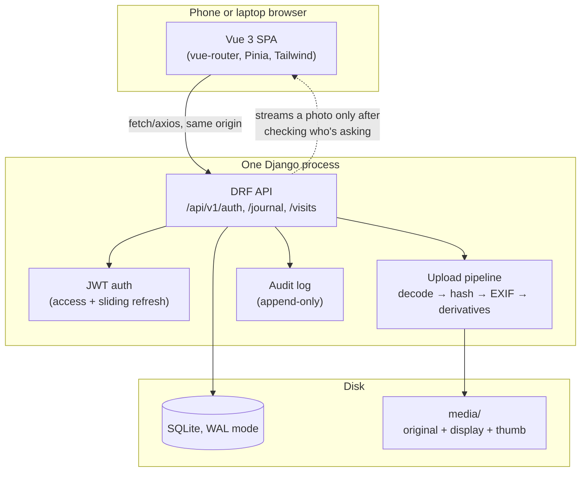
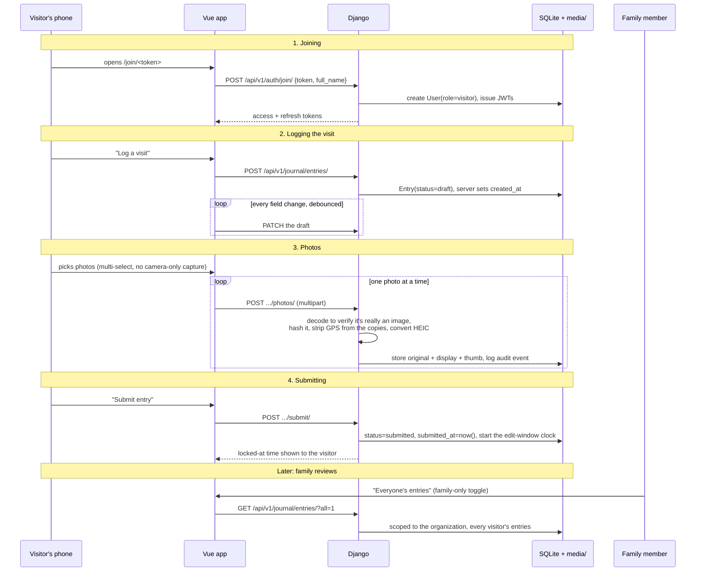

<!-- markdownlint-disable MD033 -->
# Travis's Recovery

A private journal and visit-booking calendar, built for one family, for one
reason: turning "we visited and he seemed okay" into a record that will still
mean something in a courtroom two years from now.

---

## 1. Why this exists

Travis was hit by a truck. He's recovering, and family and friends visit often
— which is good for him, and matters for something else too: this is very
likely headed toward a legal and insurance case, and cases like that are won
or lost on evidence.

**The world before this app** was a Google Sheet for booking visit slots and a
public GitHub Pages status page for updates. Both work fine for "is Tuesday
open" and "here's how he's doing." Neither one was built to survive a
deposition.

Here's the problem with informal records: a text thread, a shared doc, a
photo album on someone's phone — all of it can be edited after the fact, has
no reliable timestamp, and nobody can say for certain who took a given photo
or when. If this case goes to court, the other side's lawyers will look for
exactly that kind of gap. A photo with no chain of custody, or a note that
was quietly cleaned up two months later, doesn't just weaken itself — a
skilled defense attorney uses it to cast doubt on *every* record, including
the ones that were solid.

The insight that shaped this app: **visitors are unpaid, untrained
witnesses, and the software has to do the parts a witness can't be expected
to do themselves** — timestamp things independently of anyone's phone clock,
keep a photo's original bytes untouched, know who took what, and make it
structurally impossible to quietly edit history later. Not because anyone
involved would try to — because a record that *couldn't* be tampered with is
more convincing than a record that simply wasn't.

So: a journal where entries lock after a short window and corrections become
dated addenda instead of silent edits, photos are hashed and kept byte-for-byte
alongside their EXIF data, every meaningful action is written to an append-only
audit log, and a booking calendar replaces the spreadsheet without losing
anything it did well. Read `docs/SECURITY_AND_LEGAL.md` for the full reasoning
— it's the doc that actually shaped most of the design decisions below.

> [!NOTE]
> This app started from a general-purpose Django + Vue boilerplate (see
> `docs/USING_BOILERPLATE_AS_UPSTREAM.md`). Almost everything user-facing below
> — the journal, the photo pipeline, the calendar — was built specifically for
> this project; the auth/JWT/organization scaffolding underneath it came from
> the boilerplate.

## 2. The shape of it

Think of the app as **two witnesses working together**: the person (a
visitor, typing on their phone in a hospital hallway) and the software (a
notary standing behind them, stamping a timestamp on everything and refusing
to let anyone erase a page once it's signed). The Vue app is the interface
the visitor sees; Django is the notary — every write passes through it, and
it's the only thing that ever touches the database or the photo files.



**Why same-origin matters here, specifically:** in production, Django serves
the *built* Vue app itself (see `docs/HOSTING.md`) — one process, one domain,
no CORS to configure and no separate frontend host to secure. In local
development, Vite's dev server runs separately for hot-reload and proxies
`/api`, `/admin`, and `/static` back to Django (`frontend/vite.config.ts`), so
the same request paths work identically in both places.

**Why photos never get a public URL:** every photo request
(`GET /api/v1/journal/photos/:id/:variant/`) is checked by Django before
anything is streamed back — is this person logged in, are they the uploader
or on the family account, has this photo been soft-deleted. There's
deliberately no `MEDIA_URL`. A guessed or leaked link returns nothing.

## 3. Cast of characters

Ordered roughly from foundational to orchestrating — later ones lean on the
ones above them.

- **Organization** — There's exactly one in normal use ("Travis's Family"),
  created once by `bootstrap_family`. Everything else hangs off it, and it's
  the hard boundary the app enforces: a query for "everyone's entries" is
  always scoped to one organization, never all of them.
- **User** (`role`: `visitor` or `family`) — Visitors join through an invite
  link with just their full name (no password — see `Invite` below); family
  accounts log in with email/password and can see and manage everything in
  the organization. The role lives in a real database column, on purpose —
  see the security comment on `apps/users/models.py`.
- **Invite** — The shareable join link. Rotating it invalidates the old one
  immediately; people who already joined keep their own accounts and stay
  signed in. `join/` is rate-limited.
- **Entry** — One visitor's account of one visit: pain level, a trend
  (better/same/worse), and free-text answers to a small, deliberately-short
  questionnaire (`frontend/src/config/questionnaire.ts`, mirrored server-side
  in `apps/journal/serializers.py`). Starts as a `draft`; becomes `submitted`
  (and starts its edit-window clock) when the author's ready.
- **EntryRevision / Addendum** — The two ways an entry changes after the
  fact. A revision is an automatic snapshot taken *before* any edit within
  the edit window (`ENTRY_EDIT_WINDOW_HOURS`, default 24h). An addendum is a
  dated, appended correction — the *only* way to add to an entry once it's
  locked, and it never touches the original text.
- **Photo** — Kept in three forms: `original` (untouched bytes, EXIF intact,
  SHA-256 hashed, never regenerated), `display` and `thumb` (JPEG
  derivatives, HEIC converted, GPS stripped). The filename is derived from
  the hash, never from the uploader's filename.
- **AuditEvent** — Append-only, no admin edit or delete permission at all
  (enforced in `apps/journal/admin.py`, not just convention). Every submit,
  edit, addendum, and photo action writes one.
- **Visit** — A booking on the calendar, or (family-only) a blocked range
  like "surgery 10am, no visitors." A capacity rule (`MAX_CONCURRENT_VISITORS`,
  default 3) caps how many can overlap; cancelling sets a status rather than
  deleting the row, so the slot's own history survives too.

## 4. Follow a visit, start to finish

The most concrete way to understand the system is to trace one real path
through it — a family member sends a link, a friend visits, and the record
gets made.



The same shape applies to the calendar: a visitor books a slot
(`POST /api/v1/visits/`), the server checks it against `MAX_CONCURRENT_VISITORS`
and any family-created blocks before accepting it, and a 409 with a specific
reason comes back if it doesn't fit — never a silent failure.

## 5. Field guide

### Quick start (local development)

```bash
./dev.sh
```

That one command applies migrations, picks free ports starting at `8800`
(backend) and `5177` (frontend), wires the Vite proxy and CORS origins to
match, and stops both processes on Ctrl+C. First run: if `SECRET_KEY` is
still the `.env.example` placeholder, it'll prompt you to generate one (or
set `DEV_GENERATE_SECRET_KEY=1` for unattended setups).

To run the pieces by hand instead:

```bash
# Backend
cd backend
uv venv && source .venv/bin/activate
uv pip install -r requirements.txt
cp .env.example .env
uv run python manage.py migrate
uv run python manage.py bootstrap_family --org-name "Travis's Family" \
    --admin "Your Name <you@example.com>"
uv run python manage.py runserver 8800

# Frontend (separate terminal)
cd frontend
corepack enable   # enables pnpm if you don't have it
pnpm install
cp .env.example .env
pnpm dev
```

`bootstrap_family` is re-runnable — it reuses the organization if it exists
and only sets a password on admins it actually creates, printing both the
password and the join link.

### Secrets: the encrypted keychain

Production secrets (and a few tunable settings) live in an encrypted
keychain, not in `.env` — see `backend/keychain/`.

```bash
cd backend
uv run python -m keychain init --from-example
uv run python -m keychain set "SECRET_KEY=$(uv run python -c 'import secrets; print(secrets.token_urlsafe(50))')"
uv run python -m keychain set "ALLOWED_HOSTS=your-domain.com"
uv run python -m keychain doctor
```

`keychain.key` is the master key (`backend/keychain.key`, git-ignored) —
back it up somewhere other than the server. Without it, `keychain.json` is
unrecoverable. Rotate it with `python -m keychain rotate-key`.

| Setting | Default | Notes |
|---|---|---|
| `SECRET_KEY` | — (required) | Django's standard secret |
| `ALLOWED_HOSTS` | — (required in production) | Comma-separated; `production.py` refuses to start with `*` |
| `CORS_ALLOWED_ORIGINS` | — | Not needed in production — same-origin serving, see §2 |
| `TRUST_PROXY_SSL_HEADER` | `1` | Set `0` on shared hosting with no reverse proxy — see `docs/HOSTING.md` |
| `ENTRY_EDIT_WINDOW_HOURS` | `24` | How long an author can still edit a submitted entry |
| `MAX_CONCURRENT_VISITORS` | `3` | Calendar capacity rule |
| `JWT_ACCESS_TOKEN_LIFETIME_MINUTES` | `60` | |
| `JWT_REFRESH_TOKEN_LIFETIME_DAYS` | `60` | Long on purpose — visitors join by link on their phones and the refresh endpoint slides the session forward each time it's used |

### Project structure

```
travis-recovery/
├── dev.sh, dev.py          # one-command local dev runner
├── deploy.sh                # deploy helper for shared hosting — see docs/HOSTING.md
├── docs/
│   ├── HOSTING.md            # deployment how-to (Namecheap/cPanel shared hosting)
│   ├── SECURITY_AND_LEGAL.md # the doc that actually shaped the design
│   └── USING_BOILERPLATE_AS_UPSTREAM.md
├── backend/
│   ├── passenger_wsgi.py     # shared-hosting entry point (cPanel Passenger)
│   ├── config/
│   │   ├── settings/          # base.py, local.py, production.py, test.py
│   │   ├── urls.py             # API routes + the SPA catch-all, last
│   │   ├── spa.py              # serves the built index.html
│   │   └── middleware.py       # X-Robots-Tag: noindex
│   ├── apps/
│   │   ├── organizations/      # the one-tenant boundary
│   │   ├── users/                # custom User, Invite, JWT auth, bootstrap_family
│   │   ├── journal/              # Entry, Photo, Addendum, AuditEvent, upload pipeline
│   │   └── visits/                # the booking calendar
│   └── keychain/                # the encrypted secrets store (its own package)
└── frontend/
    ├── src/
    │   ├── views/                  # NewEntryView, EntryDetailView, CalendarView, ...
    │   ├── config/questionnaire.ts # the journal's prompts — mirrors the server whitelist
    │   ├── services/                # axios wrapper + one module per API area
    │   ├── stores/auth.ts            # Pinia auth store, refresh-on-401
    │   └── router/                    # vue-router, auth guards
    └── vite.config.ts                # dev-only proxy to the backend
```

### API reference

All endpoints are under `/api/v1/`. Everything except `join/`, `login/`, and
`refresh/` requires a Bearer token.

**Auth** (`/api/v1/auth/`)

| Endpoint | Method | Who | Description |
|---|---|---|---|
| `join/` | POST | Anyone with a valid token (throttled) | Full name + invite token → JWTs, creates a visitor account |
| `invite/` | GET / POST | Family | Read the current invite link / rotate it (revokes the old one) |
| `login/` | POST | Anyone | Email + password → JWTs (family accounts only) |
| `refresh/` | POST | Anyone with a refresh token | New access + refresh pair; rejects deactivated users |
| `settings/` | GET / PATCH | Authenticated | Per-user settings — inherited from the boilerplate, currently unused by this app's UI |

**Journal** (`/api/v1/journal/`)

| Endpoint | Method | Who | Description |
|---|---|---|---|
| `entries/` | GET | Authenticated | Caller's own entries; family adds `?all=1` for everyone in the org |
| `entries/` | POST | Authenticated | Create a draft |
| `entries/:id/` | GET | Author or family | Read one entry (with photos, addenda) |
| `entries/:id/` | PATCH | Author, unlocked only | Edit a draft or an entry still inside its edit window |
| `entries/:id/` | DELETE | Author, draft only | Discard an unsubmitted draft — a submitted entry can never be deleted |
| `entries/:id/submit/` | POST | Author | Locks in the edit-window clock |
| `entries/:id/addenda/` | POST | Author or family | Append a dated correction, any time, locked or not |
| `entries/:id/photos/` | POST | Author, multipart | Upload one photo (the frontend loops this per file for multi-select) |
| `photos/:id/:variant/` | GET | Uploader or family | Stream `original`, `display`, or `thumb` — the only way a photo is ever served |
| `audit/` | GET | Family | The append-only trail: edits, addenda, photo actions |

**Visits** (`/api/v1/visits/`)

| Endpoint | Method | Who | Description |
|---|---|---|---|
| `visits/` | GET | Authenticated | List bookings, optionally narrowed with `?from=&to=` (ISO-8601) |
| `visits/` | POST | Authenticated | Book a slot; family can also create a `kind=blocked` range |
| `visits/:id/` | GET / PATCH | Owner or family | Read, or reschedule (re-checked against capacity/blocks) |
| `visits/:id/cancel/` | POST | Owner or family | Sets `status=cancelled` — never deletes the row |

### Testing

```bash
# Backend — 140 tests
cd backend
uv run --with-requirements requirements.txt python -m pytest

# Frontend — 42 tests
cd frontend
pnpm test          # vitest, watch mode
pnpm test run       # single run
pnpm build            # vue-tsc + vite build — also the type-check
```

### Deploying

`docs/HOSTING.md` is the full how-to (currently written for Namecheap's
shared cPanel hosting — SSH access, cPanel's "Setup Python App"/Passenger,
Django serving the built frontend itself via WhiteNoise, no separate reverse
proxy). The short version: `git clone` on the server, `pip install` inside
the venv cPanel gives you, set a few keychain values, build the frontend
(locally is recommended — see the guide for why) and `rsync` it up,
`migrate`, `collectstatic`, `bootstrap_family`, then `touch tmp/restart.txt`.
`deploy.sh` at the repo root re-runs the repeatable parts of that for every
deploy after the first.

### Traps and lessons already learned here

A few things that cost real debugging time, kept here so nobody re-discovers
them the hard way:

> [!WARNING]
> **`capture="environment"` on a file input silently breaks multi-select on
> several mobile browsers** (iOS Safari especially) — it hints the browser to
> jump straight to the camera instead of the native picker, and that
> suppresses the photo library's multi-select even with `multiple` set. Both
> photo-upload inputs in this app deliberately omit `capture` for this reason.

> [!WARNING]
> **Axios silently stringifies a `FormData` body** if a JSON `Content-Type`
> header is still set when its default `transformRequest` runs — this happens
> *before* the browser adapter ever gets a chance to clear that header for
> you. `frontend/src/services/api.ts`'s request interceptor deletes
> `Content-Type` for any `FormData` body, specifically to run before that
> default transform does. A synthetic test adapter won't catch a regression
> here — the regression test in `api.spec.ts` calls the interceptor directly
> for that reason.

> [!WARNING]
> **On shared hosting (no reverse proxy), trusting `X-Forwarded-Proto` when
> nothing ever sets it causes an HTTPS redirect loop** — Django concludes
> every request is insecure and keeps redirecting. See
> `TRUST_PROXY_SSL_HEADER` above and the comment in
> `config/settings/production.py`.

> [!TIP]
> The questionnaire is deliberately 3 steps, not the 7 an early draft had.
> Fewer, more natural free-text prompts read as more credible than many short
> fragmented ones — this isn't just a UX call, it's in
> `docs/SECURITY_AND_LEGAL.md`. If you're tempted to add another field,
> read that doc first.

### Where to go next

- **Adding a field to the questionnaire**: edit
  `frontend/src/config/questionnaire.ts` and the matching whitelist in
  `backend/apps/journal/serializers.py` (`ANSWER_FIELD_MAX_LENGTHS`) — no
  migration needed, `answers` is a JSONField.
- **Adding a new Django app**: `cd backend && uv run python manage.py startapp myapp`,
  then register it in `INSTALLED_APPS` (`config/settings/base.py`).
- **Changing anything about evidence handling** (the edit window, what gets
  audited, what a soft-delete looks like): read `docs/SECURITY_AND_LEGAL.md`
  first — most of those decisions were made for a specific reason tied to how
  this record might get used later.
